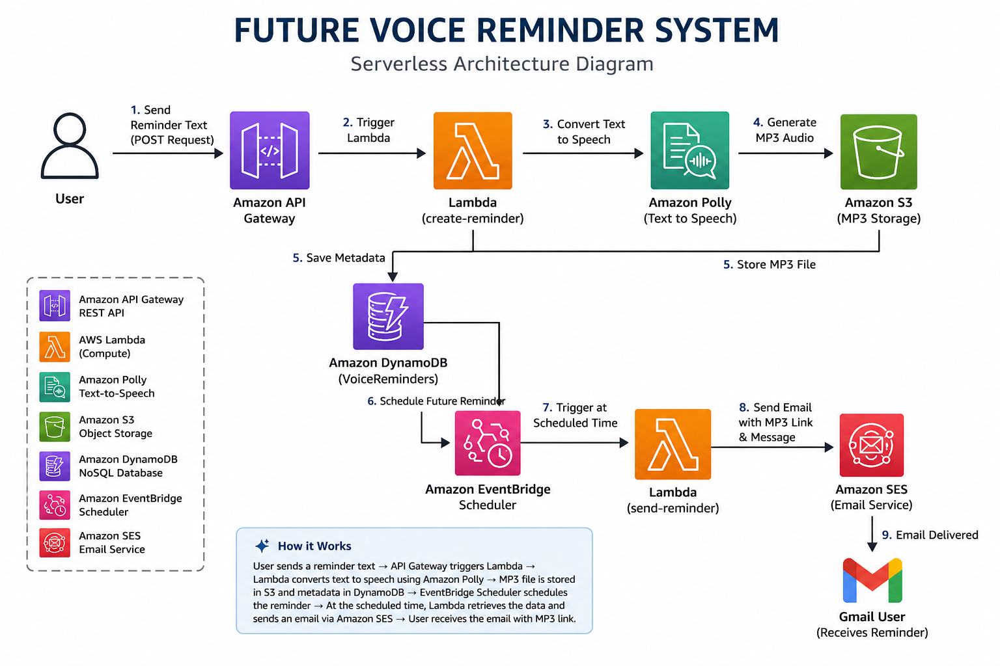

# 🔔 Future Voice Reminder System

A fully serverless AWS application that converts reminder text into speech using Amazon Polly, stores MP3 files in Amazon S3, saves metadata in DynamoDB, schedules future reminders using EventBridge Scheduler, and sends automated email notifications with playable voice reminder links via Amazon SES.

## 🚀 Features

* REST API using Amazon API Gateway
* Text-to-Speech conversion with Amazon Polly
* MP3 storage in Amazon S3
* Reminder metadata storage in DynamoDB
* Automated scheduling with EventBridge Scheduler
* Email notifications using Amazon SES
* Fully serverless and event-driven architecture
* Built with Python and Boto3

## 🏗️ Architecture

## 🛠️ AWS Services Used

* Amazon API Gateway
* AWS Lambda
* Amazon Polly
* Amazon S3
* Amazon DynamoDB
* Amazon EventBridge Scheduler
* Amazon SES
* Amazon CloudWatch
* AWS IAM

## 🔄 Workflow

1. User submits a reminder through API Gateway.
2. Lambda receives the request.
3. Amazon Polly converts text into speech.
4. MP3 file is stored in Amazon S3.
5. Reminder metadata is saved in DynamoDB.
6. EventBridge Scheduler creates a future trigger.
7. At the scheduled time, EventBridge invokes a second Lambda.
8. Lambda retrieves reminder details from DynamoDB.
9. Amazon SES sends an email containing the reminder message and MP3 link.
10. User clicks the link and listens to the voice reminder.

## 💻 Tech Stack

* Python
* Boto3
* AWS Serverless Services

## 📧 Sample Output

The user receives an email containing:

* Reminder ID
* Reminder Message
* MP3 Audio Link

which can be opened directly from the email and played in the browser.

## 📌 Future Enhancements

* SMS notifications using Amazon SNS
* Custom reminder dates and times
* User-specific email addresses
* Web frontend dashboard
* Authentication and user accounts
